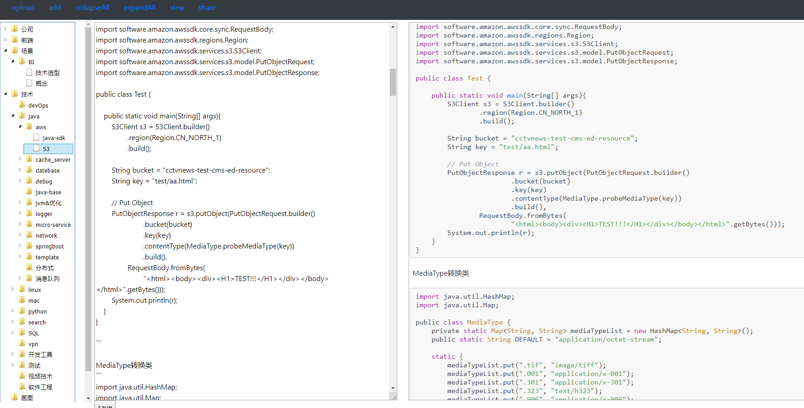
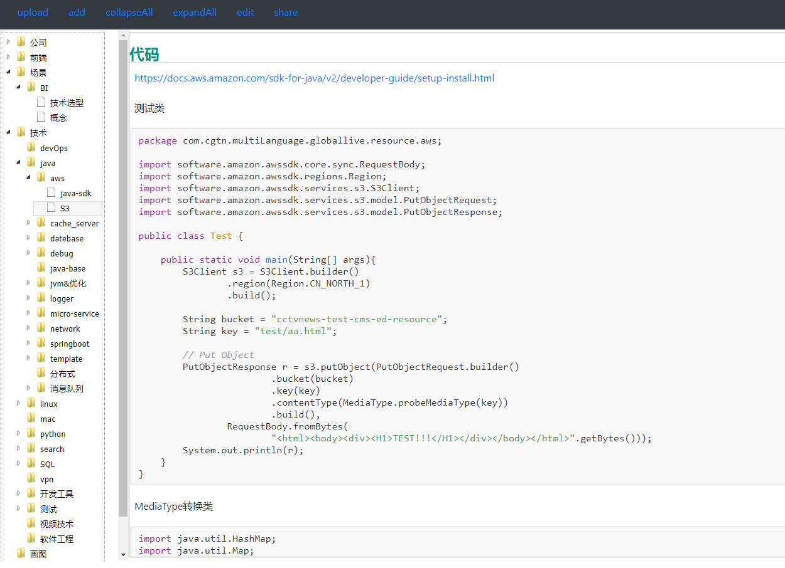
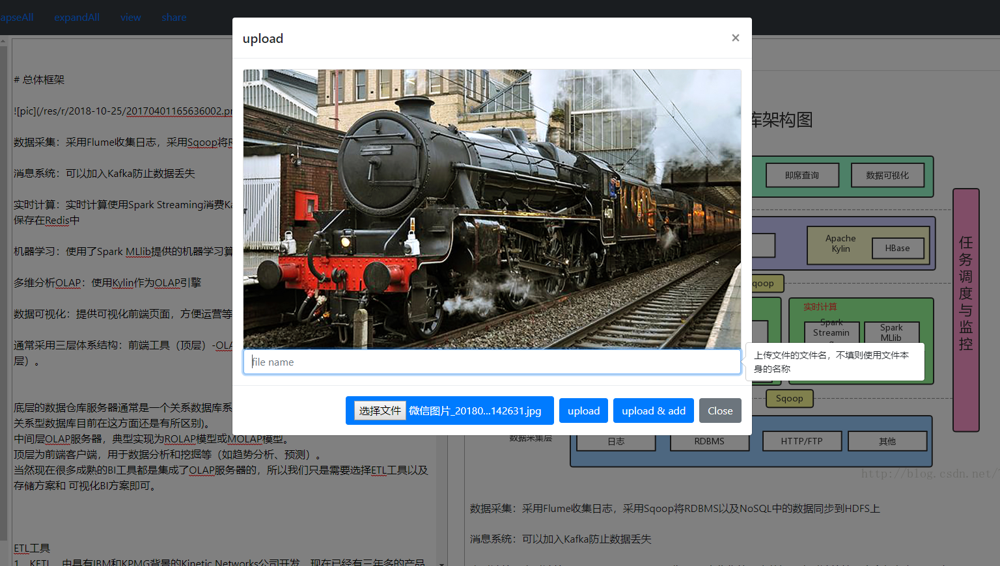
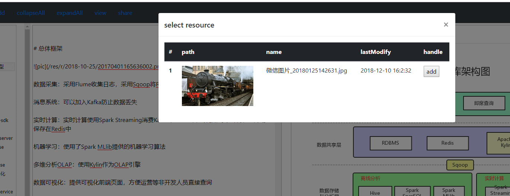

# wiki

基于本地文件夹，扫描文件目录的wiki。
- 不依赖第三方数据库，仅使用文件目录扫描，文件目录及markdown即为wiki本身，方便后续迁移至其他平台。
- 图片上传
  - 支持本地图片选择上传（顶部菜单upload / add）
  - 支持截图直接粘贴至正文(chrome兼容，其他浏览器未知)
- 文档管理
  - 目录增删改（左侧树右键菜单）
  - markdown增删改（左侧树右键菜单）

# 基本功能

- 编辑器模式：点击上方edit按钮切换


- 阅读模式：点击上方edit按钮切换


- 保存：在编辑器中ctrl+s 或下方保存按钮
- 文件增删改
  - 更新文件/文件夹名：点击已选中的菜单树，可以进行重命名
  - 删除文件，右键呼出菜单进行删除
  - 创建文件，右键呼出菜单进行创建
  - 恢复文件，误删的文件，在temp文件夹下保存，所有删除操作为mv删除节点到temp文件夹下，拷回即可恢复

- 图片上传
  - 上传截图：在编辑器中ctrl+v/粘贴 图片，截图会自动添加在编辑器中
  - 上传图片文件：上方upload菜单，选择图片上传，可以重命名。

  - 查看本日上传的历史图片，并添加到正文

  - 资源文件：所有上传的图片资源，在配置文件的资源目录下保存，每天的资源按文件夹保存

# 施工中
- markdown自动索引，增加搜索功能
- 登陆权限控制
- 编写markdown优化
  - 多选内容tab缩进
  - ctrl+z回退等

## config
修改配置fran-wiki\web\src\main\resources\application.yaml
```yaml
#修改markdown存放路径及资源文件存放路径
res:
  markdownPath: "C:\\dev\\markdown\\doc"
  resourcePath: "C:\\dev\\markdown\\resources"

#修改服务端口
server:
  port: 8080
```

## build

构建js目录
```shell

cd fran-wiki\web\src\main\resources\front
npm run watch
```

构建java
```shell

cd fran-wiki
mvn package -Dmaven.test.skip

cd fran-wiki\web\target
java -jar web.jar

```


